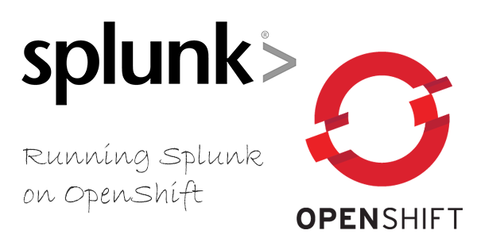

I first used Splunk about 10 years ago after an old colleague installed it on a computer in the corner, and ever since then I have preached about it. If you have log data, of any kind, I'd recommend you give it a go.  

  

The Splunk people have a a few pretty good options for trying Splunk out, as you can either use [Splunk Storm](https://www.splunkstorm.com/) or Splunk Free. The first option is obviously hosted, and has a generous storage option, but also does not allow long term storage of data. I send system log data to Splunk Storm.

  

However, what if you don't have a lot of data, but you want to keep that data forever? After reading [Ed Hunsinger's](https://twitter.com/edrabbit) [Go Splunk Yourself](http://blogs.splunk.com/2013/10/22/go-splunk-yourself/) entry about using it for Quantified Self data, I knew I had to do the same.

  

From personal experience, Splunk requires _at least_ 1GB to even start. You can probably get it to run on less, but I haven't had much success. This leaves two options: look at [Low End Box](http://lowendbox.com/) for a VPS with enough memory (as cheap as $5/month), of use [OpenShift](https://www.openshift.com/). Red Hat generously provides three "gears" to host applications, for free, and each with 1GB of memory. I have sort of a love-hate relationship with OpenShift, maybe a bit like using OAuth. Red Hat calls OpenShift the "Open Hybrid Cloud Application Platform", and I can attest that it is really this. They have provided a method to bundle an application stack and push it into production without needing to fuss about infrastructure, or even provisioning and management of the application. It feels like what would happen if Google App Engine and Amazon's EC2 had a child. Heroku or dotCloud might be its closest alternatives.

  

Anyways, this isn't a review of OpenShift, although it would be a positive review, but instead on how to use OpenShift to host Splunk. I first installed Splunk in a gear using Nginx as a proxy, and it worked. However, this felt overly complex, and after one of [my colleagues](https://twitter.com/aeriadesign) started working on installing Splunk in a cartridge, I eventually agreed this would be the way to go. The result was a Splunk cartridge that can be installed inside any existing gear. Here are the instructions; you need an OpenShift account, obviously. The install should take less than ten clicks of your mouse, and one copy/paste.

  

From the [cartridge](https://github.com/kelvinn/openshift-splunk-cartridge)'s GitHub README:

  

1.  Create an Application based on existing web framework. If in doubt, just pick "Do-It-Yourself 0.1" or "Python 2.7"
2.  Click on "Continue to the application overview page."
3.  On the Application page, click on "Or, see the entire list of cartridges you can add".
4.  Under "Install your own cartridge" enter the following URL: https://raw.github.com/kelvinn/openshift-splunk-cartridge/master/metadata/manifest.yml
5.  Next and Add Cartrdige. Wait a few minutes for Splunk to download and install.
6.  Logon to Splunk at: https://your-app.rhcloud.com/ui

  

More details can be read on the cartridge's GitHub page, and I would especially direct you to the [limitations](https://github.com/kelvinn/openshift-splunk-cartridge#limitations) of this configuration. This will all stop working if Splunk makes the installer file unavailable, but I will deal with that when the time comes. Feel free to alert me if this happens.