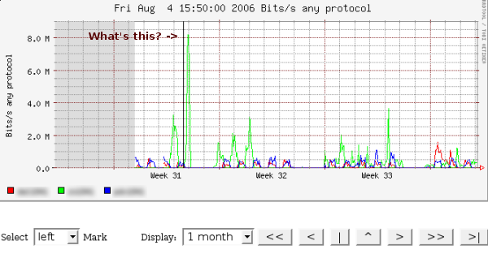
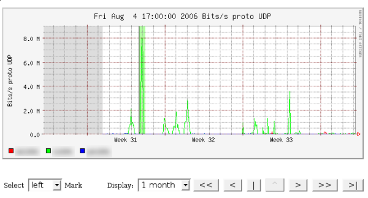
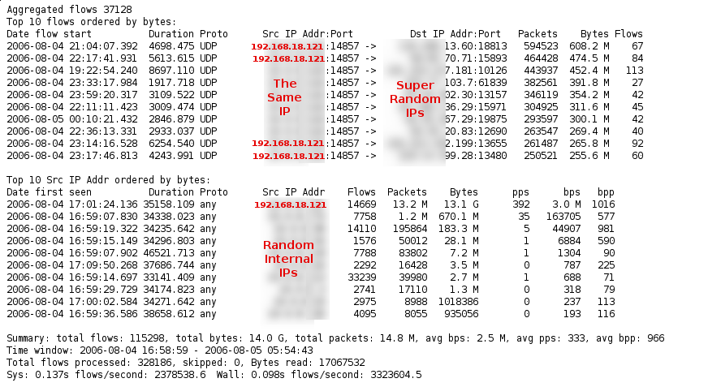

Information is power, or so many of us think. As an I.T. administrator, no matter what the level, it is of my opinion that knowing what your network is doing is important. This includes regular operation, what it could do in the event of a disaster, or when it is just slightly not functioning.

Jeez, I'm personifying a computer network.

As I wrote in another post, I setup [network monitoring](http://www.kelvinism.com/projects/monitoring-traffic-usage/) for several nodes. But, what happens when an anomaly occurs? This is the story of hunting down a worm/virus, from far, far away.

While I can't go into too many details, for obvious reasons, I'll try and tell the story as-it-The overall process took for cleaning took several weeks to resolve, although minimizing the effect occurred the second the anomaly was discovered. The lengthy time to resolve is mainly due to the time to request computers to be patched/updated/scanned (like I said, this anomaly was with a large branch office in another country).

I've blurred out any relevant information for obvious reasons.

Almost immediately after setting up monitoring I noticed something strange occurring. As you can notice from the below graph (from [nfsen](http://nfsen.sourceforge.net/)), something is obviously wrong. If you can't notice it, that big spike, in what we'll call Network Green, should give you a clue. Now, I can expect a spike during lunch when people watch movies or send their 50mb picture email attachments, but this spike isn't always at noon, and as we'll see, it sure ain't emails.

  
  

**Find the anomaly:**

  

  
  
  

So, let's try to find out what is going on. Indeed, there are some analyzers of flow traffic that can display the types of traffic, and are useful if the issue isn't apparent, but NFSEN's filtering capabilities haven't failed me yet (although seeing a graph with types of traffic is useful).

We can now take a look at what is going on. Let's next just take a look at the statistics offered:

  

  
  
  

I've left the dates in there for you to see something interesting: Network Green transferred over 15 GIGS of UDP traffic. If we think back to networking basics, we can remember that UDP is a connectionless protocol. So, what uses UDP? DNS/TFTP, some streaming media, VoIP, and several types of encryption. That said, there isn't any legitimate reason for any of the employees to use that much bandwidth, of this type. Only one thing seemed apparent: somebody was massively downloading from some p2p source, or we had a worm/virus.

Now that we know it is UDP related, let's find out more. I've filtered by UDP in the graph just so you can see how much traffic that really is. Let's select the anomaly. We first select the left side...

  
  
  

  
  
  

Then we select the right side, and we have a pretty green highlighted section.

  
  
  
  

  
  
  
  

Now it is time to hunt the person down. Using NFSEN's built-in filtering capabilities, I was able to find which computer was being naughty. I first created the filter rule for the appropriate network (IP obscured for confidentiality):

  
  
  

  
  
  

Then could see the obvious place to look next:

  
  
  

  
  
  

As is highlighted, you can see that one IP is continually transferring UDP traffic over port 14857. Well, it certainly isn't DNS or TFTP! (But we knew that when 15+ gigs was transferred:) When we look at the Top 10 Src IP Addr, ordered by bytes, we can see that one IP transferred a whole lot of traffic.

What now? I pulled out the [nmap](http://http://insecure.org/nmap/)/[nessus](http://www.nessus.org/) combo and tried to see what was running. Telneting to port 14857 didn't return any form of hello message, and nmap didn't return any known services for whatever was on port 14857. At this point I sent out the emails/documentation to managers in the remote office requesting for anti-virus to be checked and loaded onto any computers. Next, I blocked the port, from that computer, from sending outgoing traffic. Occasionally, as you can see in the graph, another computer or two would show the same symptoms, but within two weeks the oddity had disappeared. Thanks you NFSEN and Cisco.