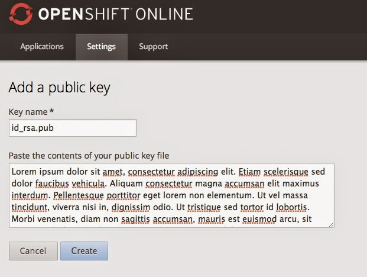
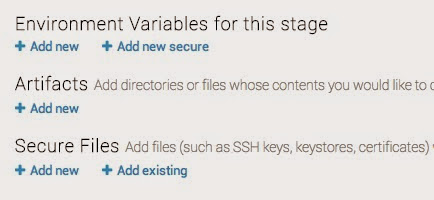
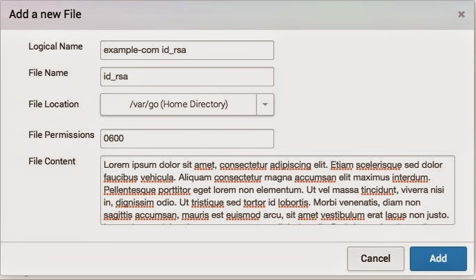
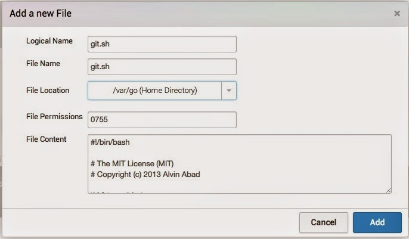

There are some wonderful [CI](http://www.thoughtworks.com/continuous-integration) / [CD](http://www.thoughtworks.com/continuous-delivery) tools out there right now, and some of them have very usable free tiers. A few good examples include [Shippable](https://www.shippable.com/), [Wercker](http://wercker.com/), [CloudBees,](http://www.cloudbees.com/products/dev) and [Snap-CI](https://www.snap-ci.com/). There are others, of course, but these all allow at least one private project to get started.  
  
I have recently moved my projects to Snap, and my hack for the day needed to be deployed to OpenShift. Although Snap has built in integrations for some providers, no such integration currently exists for OpenShift (yet!). However, it takes less than 10 minutes to configure a Deploy step to OpenShift, and here's how.  
  
**Add SSH Keys**  
You will need to add your private SSH key (i.e. id_rsa) to Snap, and your public key to OpenShift (i.e. id_rsa.pub)  
  
You can create the keys on another machine with the ssh-keygen command, and copy them into them into the corresponding places. In OpenShift, this is under Settings -> Add a new key. Once open, paste in the contents of your id_rsa.pub key  
  
[](openshift.tiff)  
  

  

  
In Snap, edit your configuration, navigate to your Deploy step, and look for "Secure Files" and "Add new"  
  
[](AddFiles.tiff)  
  

  

  
Get the content of the id_rsa key you generated earlier and post it in the content box. It should look like this, with "/var/go" as the file location, except with a real key:  
  
[](AddIdRSA.tiff)  
  

  

  
**Enable Git Push from Snap**  
  
If you've used ssh much, you are probably aware that that you can specify an identify file with the "-i" flag. The git command has no such flag, yet, but we can create a simple bash script that emulates this (script courtesy of [Alvin Abad](http://alvinabad.wordpress.com/2013/03/23/how-to-specify-an-ssh-key-file-with-the-git-command/)).  
  
Add another New File in Snap and paste in the below script:  
  
```bash
#!/bin/bash
 
# The MIT License (MIT)
# Copyright (c) 2013 Alvin Abad
 
if [ $# -eq 0 ]; then
    echo "Git wrapper script that can specify an ssh-key file
Usage:
    git.sh -i ssh-key-file git-command
    "
    exit 1
fi
 
# remove temporary file on exit
trap 'rm -f /tmp/.git_ssh.$$' 0
 
if [ "$1" = "-i" ]; then
    SSH_KEY=$2; shift; shift
    echo "ssh -i $SSH_KEY \$@" > /tmp/.git_ssh.$$
    chmod +x /tmp/.git_ssh.$$
    export GIT_SSH=/tmp/.git_ssh.$$
fi
 
# in case the git command is repeated
[ "$1" = "git" ] && shift
 
# Run the git command
git "$@"


```  
Give this script the name "git.sh", set the file permissions to "0755", and update the file location to "/var/go".  
  
[](gitsh.tiff)  
  

  

**Profit**  
With all these parts configured correctly you can add this single line to your Deploy script:  
  
```bash
/var/go/git.sh -i /var/go/id_rsa push ssh://ABCDEFGHIJK123@example.yourdomain.rhcloud.com/~/git/example.git/


```  
Re-run the build, check your logs, and it should deploy. Good luck!