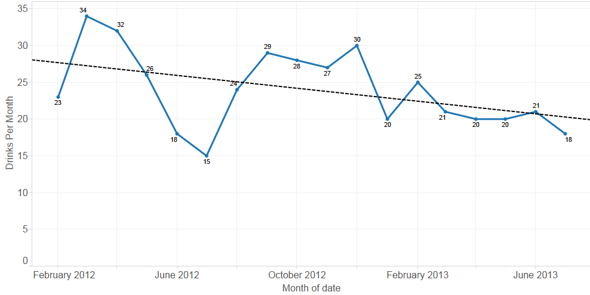
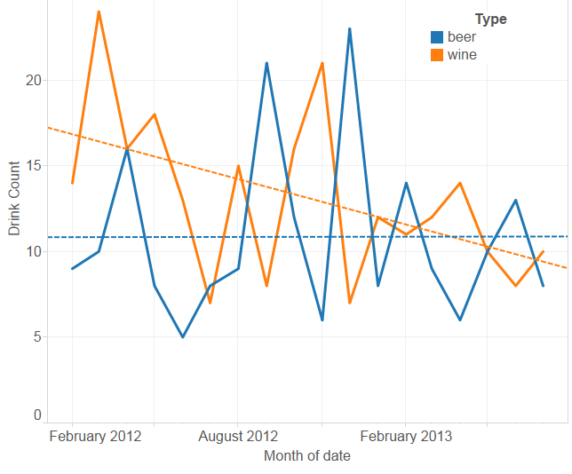
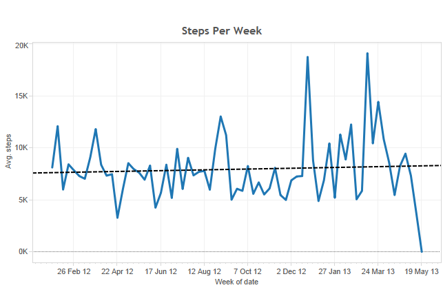
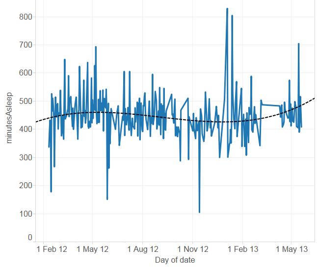
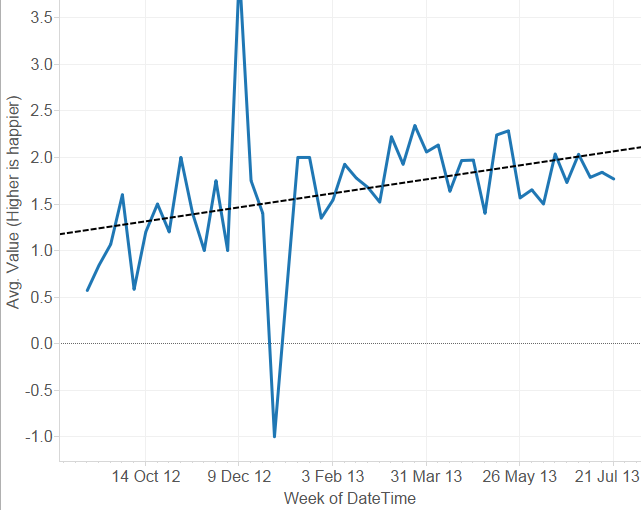
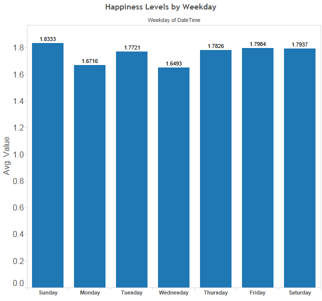
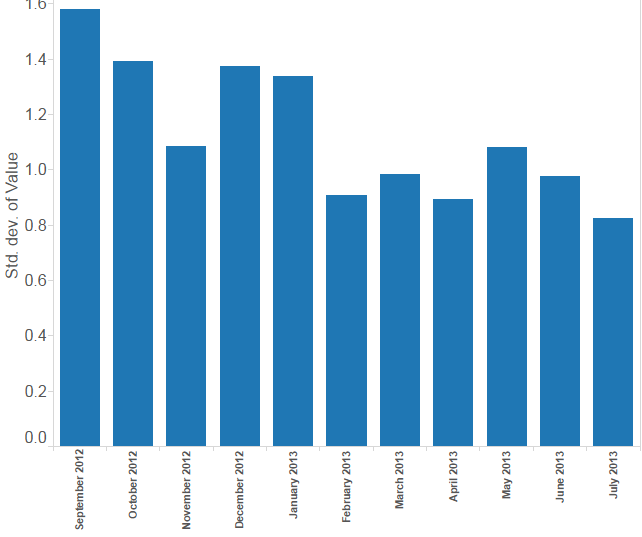
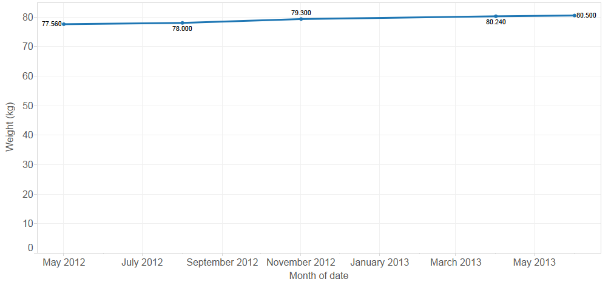

There is the possibility I will be giving an interview on the [Quantified Self](http://en.wikipedia.org/wiki/Quantified_Self) "movement". What follows is a brief summary of QS, the things I track, and some pretty charts.  
  
**What is Quantified Self**  
  
I suppose it depends on who you talk to. Wikipedia states that it is "a movement to incorporate technology into data acquisition on aspects of a person's daily life in terms of inputs", but I side more on the idea that the movement is "a collaboration of users and tool makers who share an interest in self knowledge through self-tracking." It is at this point that it is probably important to interject that most people are self-trackers: weight, height, reps at the gym, hours worked, and so forth. If you have ever made a goal, you probably tracked how you could reach it. What makes us QS folk a bit different is that we tend to track _lots_ of things, correlate between them, and share our results. So, with this theme, let me share what I track.  
  
**What I Track, and How**  
  
This is a list of some of the things I track, and the tools I use to do so.  
  

*   Weight / Body Fat / Temperature / Measurements -> scales, callipers, ear thermometer
*   Resting Heart Rate -> oximeter
*   Drinks (wine, beer, coffee – and previously water) -> Android app (bespoke)
*   Drugs and vitamins -> Android app (bespoke)
*   Various conditions (headaches, “colds”, itchiness, nausea, sore throats, “the runs”) -> Android app (bespoke)
*   Finances (family) -> Android app (TOSHL)
*   Start/Stop times of work -> Excel…
*   Mood (Terrible to Great) -> Android app (How Are You Feeling)
*   Indoor air quality (not really QS) -> various sensors
*   Computer activity (Keystrokes / mouse clicks / mouse movement) -> WorkRave
*   Location -> Google Latitude
*   Steps & sleep -> Fitbit
*   Fitness --> Android app (Sports Tracker) and a Zephyr Bluetooth Heart Rate Monitor
*   Health History -> Microsoft HealthVault
*   Photo every day -> Android app (PhotoChron)

You can see that this list seems _utterly normal_, but still gives me enough to work with to start forming a [macroscopic](http://aether.com/themacroscope) view of life.

  

**A Few Charts**

I created these using Tableau, a fabulous piece of software for putting meaning behind numbers. These are not good examples of what the software is capable of, but it is the quickest way for me to visualise them.

  

I like coffee. It is, in all honesty, a drug. There have been times (I could probably find the date!) when I went from two cups a day to none, and I had withdrawals (headaches and nausea). I track the amount of coffee I consume to remind myself to not get into the habit of having two cups/day for too long. It is also bad for my stomach.

  

If I chart the days of the week I like to drink coffee over the last 18 months, it turns out I drink the most amount of coffee on _Saturday_. 

  

  

  
  

  

 I also enjoy an alcoholic drink from time to time, but was told in January to cut back (for my stomach's sake).

  

  

  

I track both beer and wine consumption. I have managed to cut back on wine, but not so much on beer.  
  

  

  

  

This can be explained because I tend to have beer when I go out with work colleagues or friends, but wine at home. It appears to have been easier to stop drinking with dinner than when out.  

  

For the last two years I have been wearing a [FitBit](http://www.fitbit.com/), usually, and using it to "track" my sleep.

  

  

  

It looks like I averaged about 7500 steps/day, yet started walking more in January of this year. Walking more was not a New Year's Resolution. In May I broke the clip to my FitBit, but a friend was kind enough to give me their's as a replacement. I should walk more.  

  

I should also sleep more. It appears as though maybe, just maybe, I am starting to sleep more. My average is about 7.5hr/night. This is one area I would like to experiment more with.

  

  

  

I have also started tracking happiness on a simple Terrible -> Great! scale.  

  

This graph shows my average happiness on a weekly basis for the last ~8 months. We could conclude that I'm getting more happy, and was really unhappy around Christmas.

  

  

  

  

  
And here we have my happiness levels when grouped by day of the week. We could conclude that I am, on average, the most content on a Sunday. I would like to believe it is just a coincidence that I am most content on a Sunday, and drink the least amount of coffee.  
  

  

  

  

This is the standard deviation of my happiness tracking on a monthly basis. It looks like I am also getting less moody.

  

  

  

  

And finally, weight. Nothing interesting here. I need to get back down to 77KG, which is a more natural weight for me. I use a normal scale so only record every few months - if I had a wi-fi scale, I would be able to record much more frequently. 

  

  

  

  

  

  

  

  
  

**Final Thoughts**

  
In the last ~18 months I have become more happy and less moody, with Sunday being my happiest day, and Monday and Wednesday being my least content. I have put on three KG. I drink the most amount of coffee on Saturday, the least amount on Sunday, and have been able to drink less wine, but keep drinking the same amount of beer.

  

By looking at this evaluation I know I should probably start to incorporate a lunchtime walk into my daily routine, and stop drinking coffee on one day of the weekend. I should also drink my beer at a slower pace when I'm out, as this will prevent me from buying more than one, or, even harder to resist, friends and colleagues buying it for me.  
  
Finally: I know none of the charts have a title. Read the text.