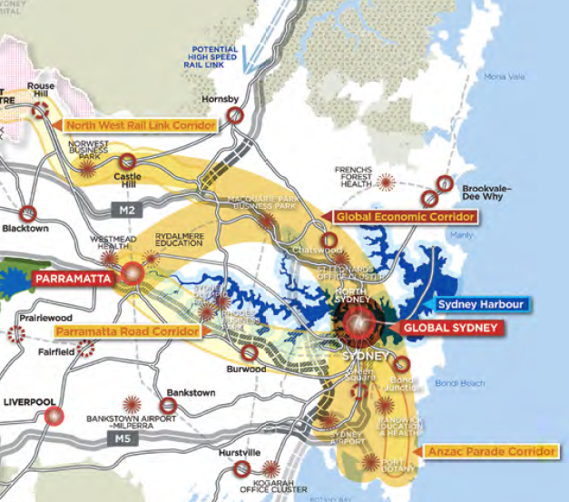

EDIT 12-03-2025: I accidentially broke the maps when deleting my AWS account, as the mbtiles were hosted there. Oops.

In [Sydney Commute Times Mapped Part 1](http://www.kelvinism.com/2013/07/sydney-commute-times-mapped-part-1.html) I took a small step to a bigger goal of mashing together public transport in Sydney, and the [Metropolitan Strategy for Sydney to 2031](http://strategies.planning.nsw.gov.au/Portals/0/Documents/MetroCommunityGuide.pdf). The question I wanted to answer is this: how aligned is Sydney's public transport infrastructure and the Metropolitan Strategy's of a "city of cities"?  
  
I decided to find out.  
  
Thanks to the release of GTFS data by 131500 it is possible to visualise how long it takes via public transport to commute to the nearest "centre".  
  

Cities and Corridors - [Metropolitan Strategy for Sydney to 2031](http://strategies.planning.nsw.gov.au/Portals/0/Documents/MetroCommunityGuide.pdf)

  
The Australian Bureau of Statistics collects data based on "mesh blocks", or roughly an area containing roughly 50 dwellings. Last week I had some fun [mapping the mesh blocks](http://www.kelvinism.com/2013/07/mapping-mesh-blocks-with-tilemill.html), as well as looking at Sydney's [urban densities](http://www.kelvinism.com/2013/07/mapping-urban-density-in-sydney.html). These mesh blocks are a good size to look at for calculating commute times.  
  
The simplified process I used was this, for the technical minded:  
  

1.  Calculate the centre of each mesh block
2.  Calculate the commute time via public transport from each block to every "centre" (using 131500's GTFS and OpenTripPlanner's Analyst tool)
3.  Import times in a database, calculate lowest commute time to each centre
4.  Visualise in TileMill
5.  Serve tiles in TileStache and visualise with Leaflet

  
The first map I created was simply to indicate how long it would take to the nearest centre. There appears to be rapidly poorer accessibility on the fringe of Sydney. I was also surprised of what appears to be a belt of higher times between Wetherill Park and all the way to Marrickville. There also appears to be poorer accessibility in _parts_ of Western Sydney. It is worth noting that I offer not guarantee of the integrity of the data in these maps, and I have seen a few spots where the commute times increase significantly in adjacent mesh blocks. This tells me the street data (from OpenStreetMap) might not be connected correctly.  
  
    
  
My next map shows what areas are within 30 minutes.  
  
These maps were both created using open data and open source tools, which I find quite neat.  
  
I have been interested in mapping traffic for a number of years, maybe ever since arriving in Sydney. It is sort of a hobby; I find making maps relaxing. My first little map was way back in 2008, where I [visualised speed](http://www.kelvinism.com/2008/04/baby-steps-at-graphing-traffic_522.html) from a GPS unit. A little later I added [some colour to the visualisations](http://www.kelvinism.com/2008/04/another-baby-step_1340.html), and then used this as an excuse to create a little [GUI for driving speed](http://www.kelvinism.com/2008/05/gui-to-plot-driving-speed_6997.html). My interest in visualising individual vehicles has decreased recently, as it has now shifted to the mapping wider systems. Have an idea you would like to see mapped? Leave a note in the comments.