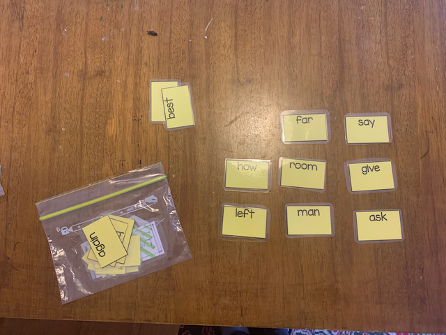
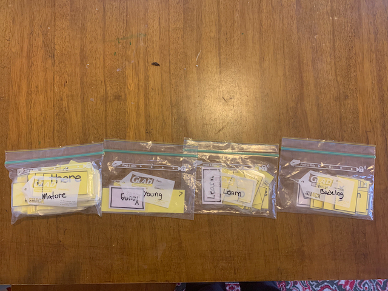

There are a lot of books on parenting. Before my daughter was born I read a book on pregnancy, one of those 500 pages texts from a high class place - Mayo Clinic or Harvard or something like that. It was helpful, but given I can't even remember the name, clearly not something that I considered life changing.

  

However, after reading [Thirty Million Words: Building a Child's Brain](https://www.amazon.com/Thirty-Million-Words-Building-Childs-ebook/dp/B00SI02BHE) I was all hyped up to drown my new kid in words. We travelled a lot when she was young, so didn't have a lot of books, but she sure had them read to her. When I took a year off as a stay-at-home-dad I kept having those 30 million words ticking in my mind. By the time she was 2 1/2 she was getting five books read to her a night. By the time she was around 3 1/2 she was listening to Amazon Story Time for an hour every evening.

  

Also around 3 she started playing [Khan Kids](https://apps.apple.com/us/app/khan-academy-kids/id1378467217), and could play it for ages if I let her. There was no doubt that she enjoyed learning, and it was lovely to see her take each new step.

  

She entered Kindy when she was about 4 1/2, so one of the younger kids. Her school was teaching them how to read by having them sound out words, look for clues, but also to just brute force a few 100 of the most frequently used words. These were called "sight words", and knowing them supposedly speeds up their comprehension for easier texts, which left more energy for the words they didn't know. Sounds good to me.

  

Without getting into too much detail, the first part of the year was quite challenging for us. At one point I realised I wasn't really helping her as much with her school work as I could have, and while she certainly wasn't falling behind, I also knew she had extra potential that wasn't being explored.

  

Given all this background, I started to take her sight words seriously. I bought a laminator and made her little flash cards, and put in place some low-fi [spaced repetition](https://en.wikipedia.org/wiki/Spaced_repetition), so she wouldn't need to go over 100s of easy words every day. This meant we could go over the "known" words on the weekend, and the less well known words over breakfast.

  

The system works like this: a new sheet gets made and we play a little game where a subset of the cards gets put on the table, and I shout out a word. She finds the word, and we put it in the "learn" bag. Sometimes she knows it, and sometimes needs to sound it out.

  

Learning New Words  

  

This is pretty easy for her, for example, if I say "give" then she knows only one word starts with a "g", so chooses that. After doing this a few times we then go through the "learn" bag like normal flash words: I show the word, and let her say it back to me. If she gets it right a few times and clearly has instant recall, then it goes in the "young" bag.

  

Getting Mastery  

  

After she gets it right a few more times, then the card goes in the "mature" bag.

  

We do the "learn" bag every breakfast, and the "young" bag every few breakfasts. We do the "mature" bag usually on the weekend or on a Monday morning. If she gets a word wrong, then it goes the other way (e.g. from "mature" back in to "young" or directly to "learn" again).

  

I am really impressed with her school, as most of the kids in kindergarten seem like they can read. Although some of the kids know more sight words than her that's not the point; she has an easier time reading, and I sometimes hear her reading to herself in her room.

  

One thing to note is that she gets no rewards for doing her sight words, but there are almost never any complaints. However, we do have an agreement that when she can read a "level 5" book, which I think is about a grade 4 book, then I will buy her a copy of Harry Potter and we will each read a copy. I can't wait!