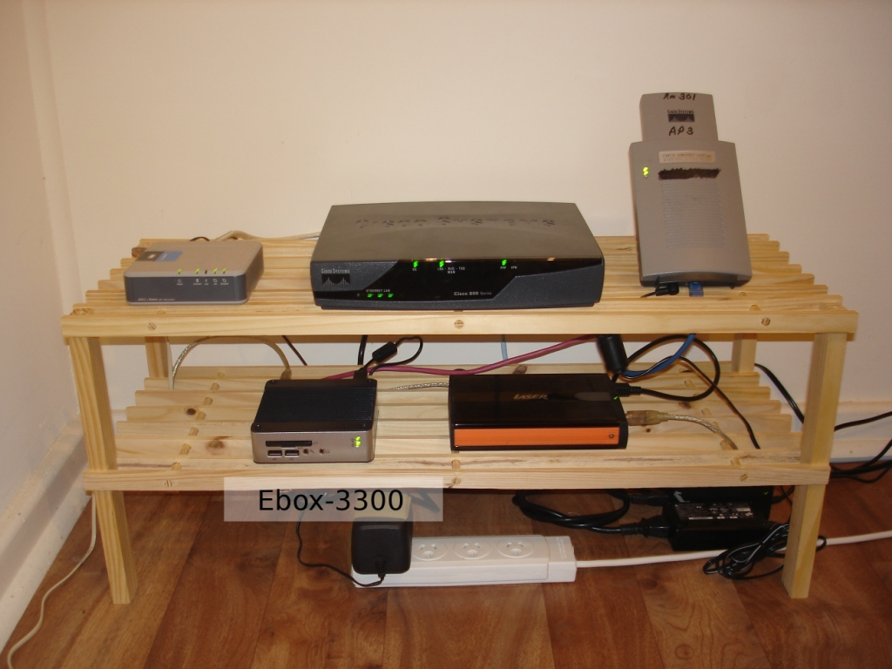

Back in 2000 I managed to acquire several retired systems to bring to Uni: this included 4-5 cheap P120 machines. At the time, I thought this was great; I had an OpenBSD box as my gateway, a FreeBSD box, a few Linux boxes, and likely something else that doesn't even exist now. The school has a superfast connection, unlimited bandwidth, and I was curious. Although I didn't really have _time_, I still managed to install and have all these servers running from my room.

I realized I was doing at home what I was being paid to do at work.

  

Fast forward to 2007, and my mindset has changed. In 2007 I didn't want to have 6 servers running at once, I wanted to have one server running 12 servers at once! Thanks to Xen and VMware this was easily obtained. Initially using Xen, and then ESXi, I had the freedom to setup Domains, tear them down, and start over. Eventually, however, I realized I was doing at home what I was being paid to do at work. That doesn't sound like fun. I also realized that, despite picking a motherboard and processor that could shift into low power usage, I was still using more watts than I needed to. I was also spending way too much time mucking around with things - I want to focus on just one or two projects at a time, and I _really_ want to start programming more.

  
  

Last month I finally finished the ultimate 'consolidation': I moved everything to a tiny embedded Linux box. While back in the U.S. I contacted [WDL Systems](http://www.wdlsystems.com/) and requested for shipping costs on a tiny embedded box. I bought the eBox-3300, with an embedded board from ICOP, and it was promptly shipped out. After returning home to Sydney I migrated all my apps from the various virtual servers to my little box running Debian 5.0: OSSEC, Samba, Lighttpd, Asterisk and flow-tools. The little box is just perfect for what I need - a tiny home server. I still get around 8MB/sec transferring files, which indicates the network is still the bottleneck, and VOIP calls with Asterisk are still clear.

Overall, I've been happy with this little box. My 'playing time' with IT has gone down significantly, my energy usage has gone down, and I now have a server I can take with me wherever I go.